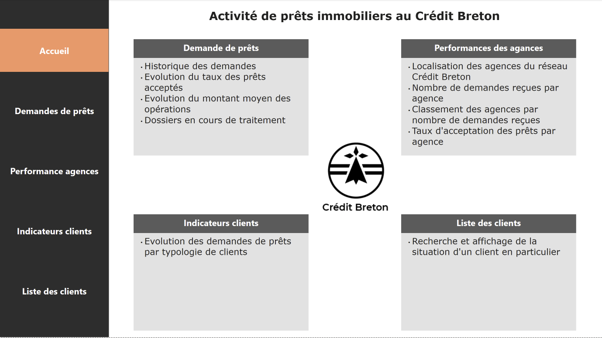
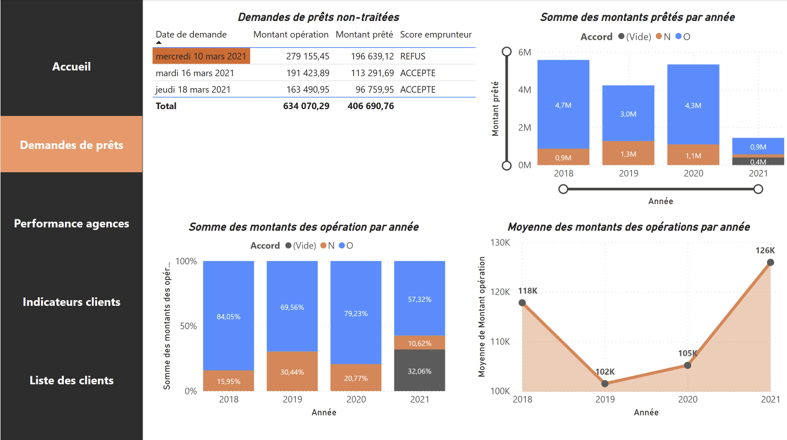
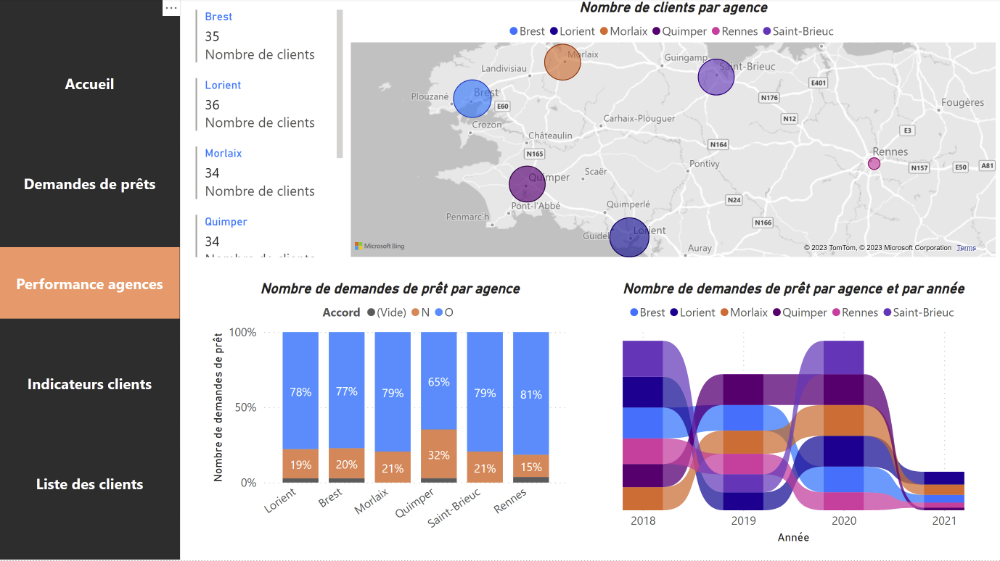
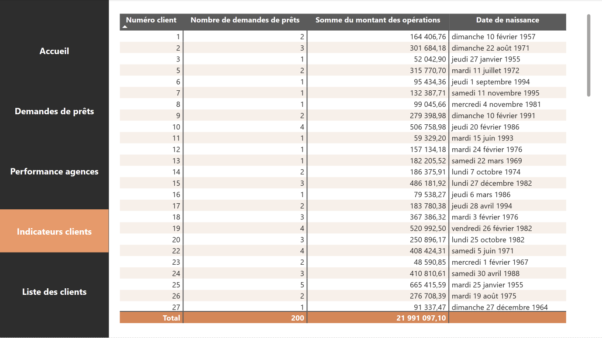
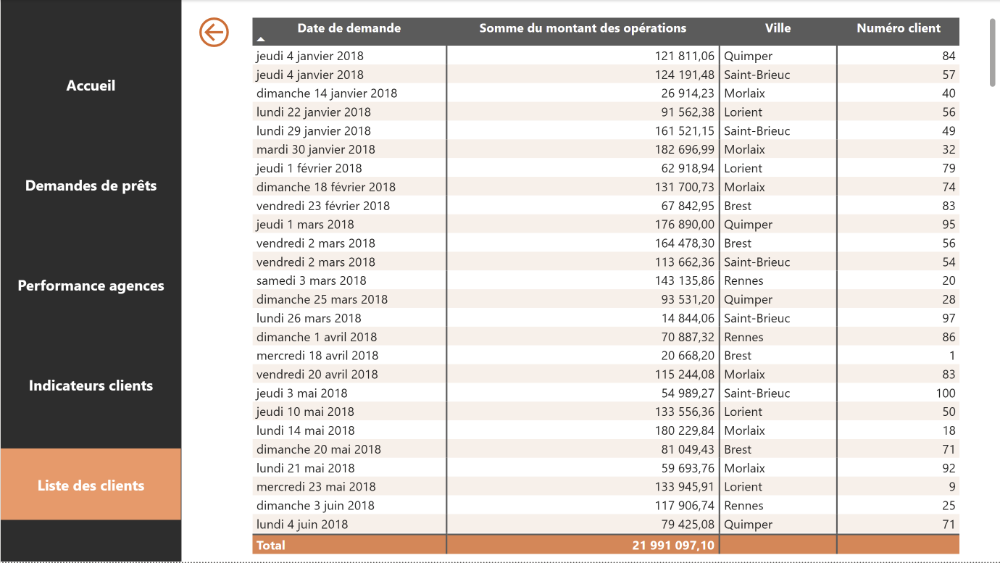

# PowerBI dashboard on Credit Breton data (in French)

Data Analysis for finance consists in exploring data for preparing strategy reports, marketing studies and elaborating dashboards to help in decision making. 

This dashboard has been created based on the OpenClassrooms course [Realisez des dashboards avec Power BI](https://openclassrooms.com/fr/courses/7110891-realisez-des-dashboards-avec-power-bi). The objective was to build a tool for decision-making assistance for granting real estate loans

**Tools**
- Power BI

